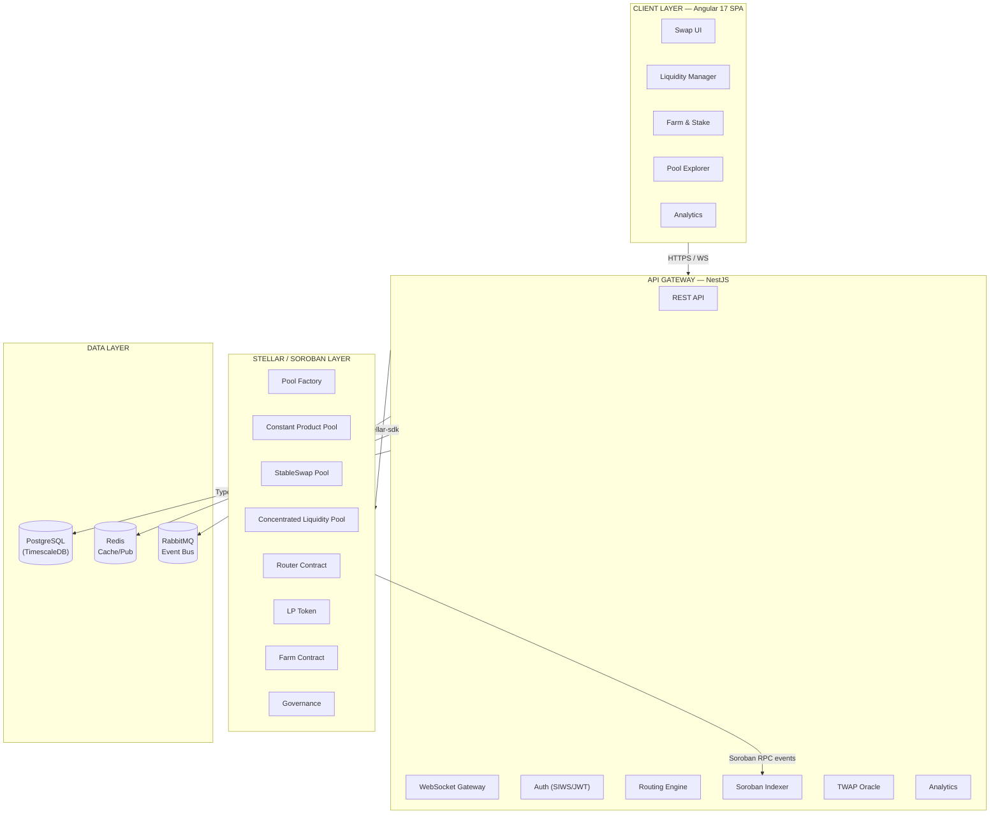

# Architecture Overview

## System Layers

SoroPool is composed of three layers:

1. **Smart Contracts** — Soroban (Rust) — settlement and custody of funds
2. **Backend** — NestJS — indexing, routing, analytics, API
3. **Frontend** — Angular 17 — user interface

## Request flows

**Swap quote:**  
Frontend → `GET /api/v1/swap/quote` → `SwapService` → `RoutingService` (graph Dijkstra) → AMM math simulation → response

**Swap execution:**  
Frontend → `POST /api/v1/swap/build` → `SwapService.buildSwapTransaction()` → unsigned XDR → Freighter wallet signs → `StellarService.submitTransaction()` → Soroban RPC

**Real-time price updates:**  
`StellarIndexerService` polls Soroban RPC → `SwapIndexerService` decodes event → updates DB → emits `pool:reserves` via `PoolsGateway` WebSocket → Frontend NgRx store

## Module summary

| Module | Responsibility |
|--------|---------------|
| `AuthModule` | Sign-In With Stellar, JWT access + refresh tokens |
| `PoolsModule` | Pool CRUD, TVL, WebSocket reserve updates |
| `SwapModule` | Quote simulation, unsigned XDR building |
| `RoutingModule` | Graph-based multi-hop path finding, split routing |
| `LiquidityModule` | LP position tracking, impermanent loss calculator |
| `FarmModule` | Yield farm positions, APR calculation |
| `OracleModule` | TWAP aggregation, price feed |
| `IndexerModule` | Soroban event polling and DB sync |
| `AnalyticsModule` | TVL, volume, fees, candlestick generation |
| `NotificationsModule` | Email / push alerts for out-of-range CL positions |
